# Variational Auto-Encoder
Paper Reimplementation —— "D. P. Kingma and M. Welling. [Auto-Encoding Variational Bayes](https://arxiv.org/pdf/1312.6114). *ICLR*, 2014."

This repository was originally created for my interest in ***Variational Auto-Encoders(VAEs)***. Although I have read the ***VAE*** pa-per for many times, I think it's still necessary to implement the generative model once by programming.  One the one hand, it can deepen my understanding of ***VAE's*** insights and meanwhile improve my proficiency in programming. On the other h-and, it can also be used as a reference when I try to implement other ***VAE-based*** models in the future. 

### Usage
This repository includes many python script file, but only 3 of them can be run independently.

If you want to retrain the model on MNIST, you can use the following command:
```
python train_mnist.py
python train_freyface.py
python run_experiments.py
```

## Experiments
Same as the original VAE paper, I trained the generative models on MNIST and FreyFace datasets.


### Likelihood lower bound


### Generation
<table align='center'>
<tr align='center'>
<td> Generated Process </td>
<td> 2-D latent space </td>
<td> 5-D latent space </td>
<td> 10-D latent space </td>
<td> 20-D latent space </td>
</tr>
<tr>
<td>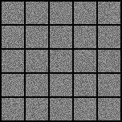
<td>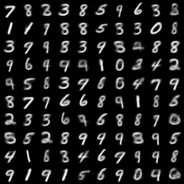
<td>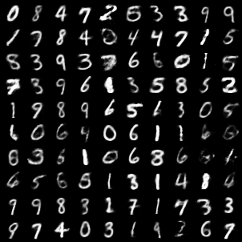
<td>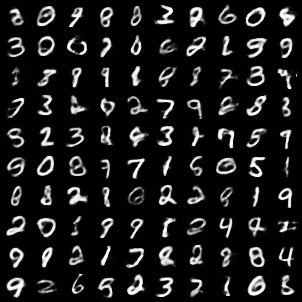
<td>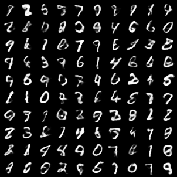
</tr>
<tr>
<td>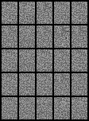
<td>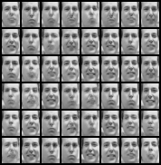
<td>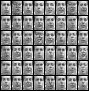
<td>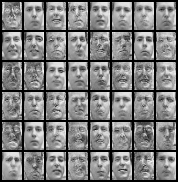
<td>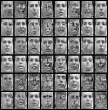
</tr>
</table>

### Reconstruction

<table align='center'>
<tr align='center'>
<td> Ground Truth </td>
<td> 2-D latent space </td>
<td> 5-D latent space </td>
<td> 10-D latent space </td>
<td> 20-D latent space </td>
</tr>
<tr>
<td>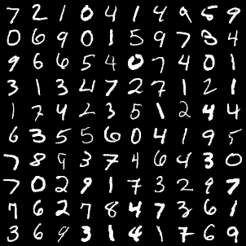
<td>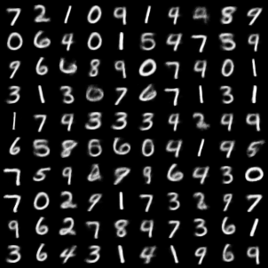
<td>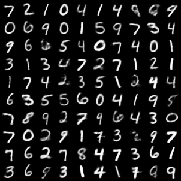
<td>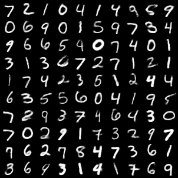
<td>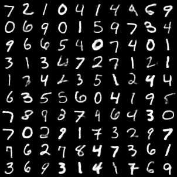
</tr>
</table>

<table align='center'>
<tr align='center'>
<td> Ground Truth </td>
<td> 2-D latent space </td>
<td> 5-D latent space </td>
<td> 10-D latent space </td>
<td> 20-D latent space </td>
</tr>
<tr>
<td>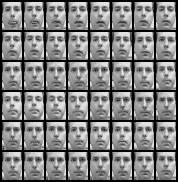
<td>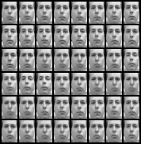
<td>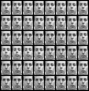
<td>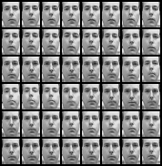
<td>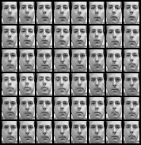
</tr>
</table>

### Manifold

<table align='center'>
<tr align='center'>
<td> Learned MNIST manifold </td>
<td> Distribution of labeled data  </td>
</tr>
<tr>
<td>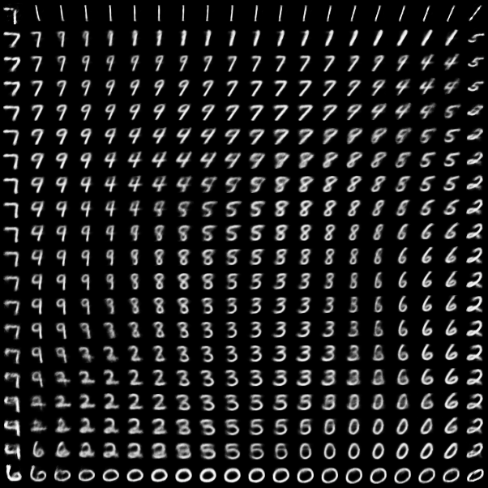
<td>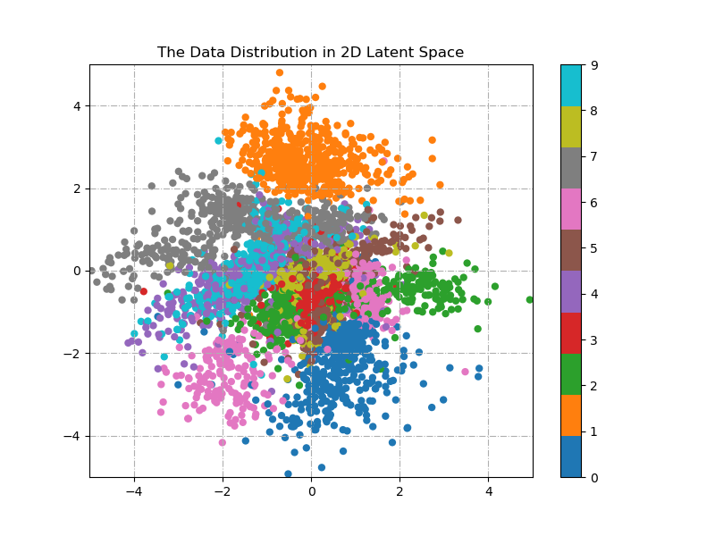
</tr>
</table>

## Dependencies
```
python         version-3.6.7
pytorch        version-0.4.1
matplotlib     version-3.1.1
numpy          version-1.17.4
scipy          version-1.3.2
```

## References 
[1]  D. P. Kingma and M. Welling. Auto-Encoding Variational Bayes. *ICLR*, 2014.

## Acknowledgements
The following two projects have given me great inspiration as I write the code, and I would like to express my gratitude.
[1] https://github.com/pytorch/examples  
[2] https://github.com/yunjey/pytorch-tutorial
