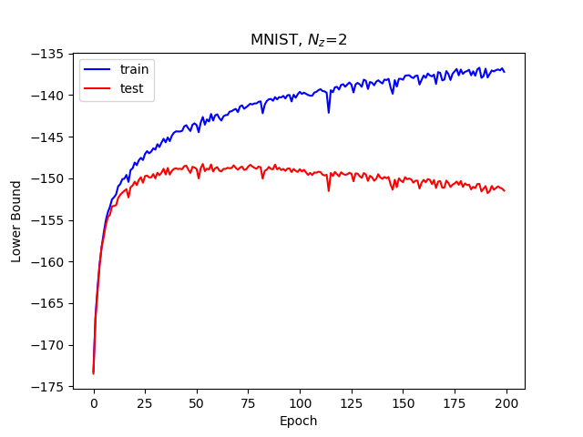
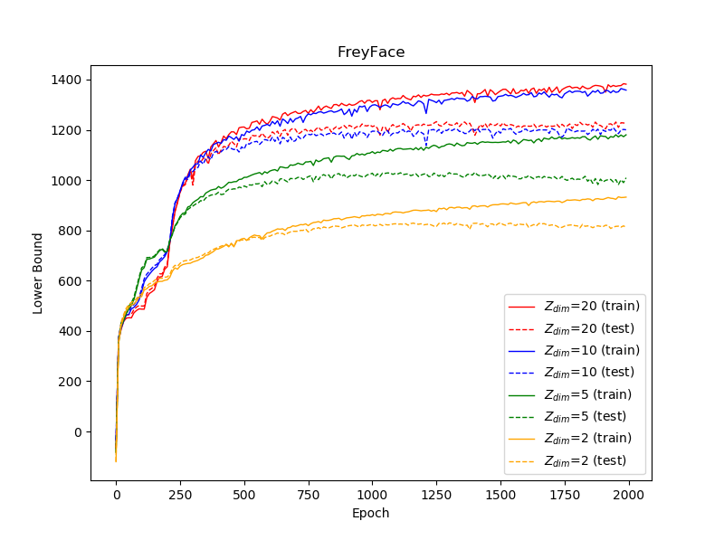

# Variational Auto-Encoder
Paper Reimplementation —— "D. P. Kingma and M. Welling. [Auto-Encoding Variational Bayes](https://arxiv.org/pdf/1312.6114). *ICLR*, 2014."

This repository was originally created for my interest in ***Variational Auto-Encoder (VAE)***. Although I have read the ***VAE*** paper for many times, I think it's still necessary for me to implement the generative model once by programming.  On the one hand, it can not only deepen my understanding of ***VAE's*** nature but also improve my proficiency in programming. On the other hand, this repository can serve as a reference when I try to implement other ***VAE-based*** models in the future. 

### Usage
In this repository, only three python script files can be run independently. <br>

If you want to retrain a model on **MNIST** dataset, you can execute this command at the terminal:
```
python train_mnist.py
```
If you want to retrain a model on **FreyFace** dataset, you can execute this command at the terminal:
```
python train_freyface.py
```
If you want to reuse trained models to do some other experiments, you can execute this command at the terminal:
```
python run_experiments.py
```
Otherwise, if you want to customize some of the hyper-parameters while training the model, then you might need to spend a little more time changing the corresponding code lines in the python script files. 

## Experiments
Same as the original VAE paper, I trained the generative models on **MNIST** and **FreyFace** datasets.


### Likelihood lower bound
<table align='center'>
  <tr>
    <td>
    <td>
  </tr>
</table>
  
### Generation
<table align='center'>
  <tr>
    <td>
    <td>
    <td>
    <td>
  </tr>
  <tr align='center'>
    <td> 2-D latent space </td>
    <td> 5-D latent space </td>
    <td> 10-D latent space </td>
    <td> 20-D latent space </td>
  </tr>
</table>
<center>Figure 3: Random samples from learned generative models of MNIST for different dimensions of latent sapce</center>

### Reconstruction

<table align='center'>
<tr align='center'>
<td> Ground Truth </td>
<td> 2-D latent space </td>
<td> 5-D latent space </td>
<td> 10-D latent space </td>
<td> 20-D latent space </td>
</tr>
<tr>
<td>
<td>
<td>
<td>
<td>
</tr>
</table>

<table align='center'>
<tr align='center'>
<td> Ground Truth </td>
<td> 2-D latent space </td>
<td> 5-D latent space </td>
<td> 10-D latent space </td>
<td> 20-D latent space </td>
</tr>
<tr>
<td>
<td>
<td>
<td>
<td>
</tr>
</table>

### Manifold

<table align='center'>
<tr align='center'>
<td> Learned MNIST manifold </td>
<td> Distribution of labeled data  </td>
</tr>
<tr>
<td>
<td>
</tr>
</table>

## Dependencies
```
python         version-3.6.7
pytorch        version-0.4.1
matplotlib     version-3.1.1
numpy          version-1.17.4
scipy          version-1.3.2
```

## References 
[1]  D. P. Kingma and M. Welling. Auto-Encoding Variational Bayes. *ICLR*, 2014.

## Acknowledgements
The following two projects have given me great inspiration as I write the code, and I would like to express my gratitude.
[1] https://github.com/pytorch/examples  
[2] https://github.com/yunjey/pytorch-tutorial
